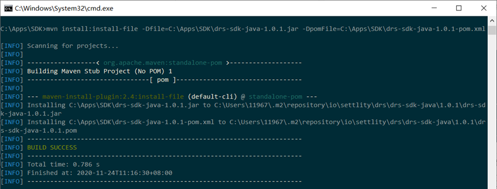
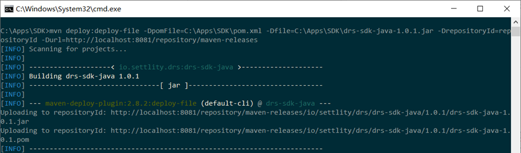

# Stacs Settlity - Java SDK 
Settlity is a Permissioned Blockchain Network built and managed by Hashstacs that exposes HTTP REST API endpoints for applications to connect and interact with the underlying distributed ledger, the Stacs blockchain. This SDK contains all essential tools for communicating with a node residing within Settlity including encryption of HTTP requests and decryption of HTTP responses since encryption in transit is enforced.

STACS enables business applications to sit on top of Settlity and run business processes by invoking smart contract functions linked to the underlying hosted blockchain infrastructure.

Reach out to the Support team at Stacs for questions at support@stacs.io

## Table of Contents 
* [Pre-requisites](#pre-requisites)
* [Two Ways to Setup the SDK as a Maven dependency](#sdk-setup-maven-dependency)
    * [Setting up the SDK in a local environment](#sdk-setup-local)
    * [Setting up the SDK in a remote server](#sdk-setup-remote)
* [Using the SDK](#using-the-sdk)
    * [Configuring the Connector](#configuring-the-connector)
    * [Settlity API Request Creation](#api-request-creation)
    * [Sample Usage](#sample-usage)
        * [Creation of Wallet Addresses for Users](#wallet-creation-sample)
        * [Transfer of Assets - Invoking Smart Contract Functions](#transfer-sample)
* [Mapping of API Endpoints and SDK Methods](#api-sdk-mapping)
* [Common Errors](#common-errors)

### Pre-requisites
- JDK 1.8 and above
- Maven 3.5 and above 

To connect to the network you will need the following Merchant details: 
- DRS URL
- Merchant Id
- Your Private Key 
- DRS Public Key
- drs-sdk-java-1.0.1.jar (SDK Library)

Please reach out to the Support team at support@stacs.io for these details to create an account.

### SDK Setup Maven Dependency
In this document, we provide 2 ways you could setup the required jar library (drs-sdk-java-1.0.1.jar):
 1. in either a local development environment or 
 2. a remote server for Maven repositories

#### SDK Setup Local
To setup the SDK library in your local environment, run the following command:
```
mvn install:install-file -Dfile=C:\Apps\SDK\drs-sdk-java-1.0.1.jar -DpomFile=C:\Apps\SDK\drs-sdk-java-1.0.1-pom.xml
```

You should see the following results in your local environment:


Once the SDK library has been setup successfully in your local environment, you can setup your `pom.xml` with the following dependency:
```
<dependency>
    <groupId>io.settlity.drs</groupId>
    <artifactId>drs-sdk-java</artifactId>
    <version>1.0.1</version>
</dependency>
```

Congrats! You can now proceed to use the SDK library to access the smart contract functions on the network. 

#### SDK Setup Remote
If you need to deploy the SDK library and host it in a remote server for Maven repositories, you can do so with the following command:
```
mvn deploy:deploy-file -DpomFile= <path-to-pom> -Dfile= <path-to-file> -DrepositoryId= <id-to-map-on-server-section-of-settings.xml> -Durl= <url-of-the-repository-to-deploy>
```

You should see the following results:

 
Once the SDK library has been setup succesfully in your remote repository, you can setup your `pom.xml` with the following configuration settings:
```
<dependency>
    <groupId>io.settlity.drs</groupId>
    <artifactId>drs-sdk-java</artifactId>
    <version>1.0.1</version>
</dependency>

``` 

You may also need to specify the following remote server authentication details in the `pom.xml`:
```
<servers>
    <server>
        <id>repositoryId</id>
        <username>username</username>
        <password>password</password>
    </server>
  </servers>

```

Do add your remote repository URL details to the `pom.xml` as well:
```
<repositories>
    <repository>
        <id>repositoryId</id>
        <url>http://localhost:8081/repository/maven-public/</url>
    </repository>
  </repositories>
```

Note: There may be additional security configurations required in your `pom.xml` depending on the requirements of your remote repository server. 

### Using the SDK
The code samples used in this section are provided in the file `sample.java`.

You will need to import the following libraries in order to effectively use this SDK:
```
import io.settlity.drs.client.DrsClient;
import io.settlity.drs.client.DrsClientConfig;
import io.settlity.drs.client.DrsClientFactory;
import io.settlity.drs.client.vo.CommonResponse;
import io.settlity.drs.client.vo.biz.AddressCreateRequest;
import io.settlity.drs.client.vo.biz.IssueMessageResponse;
import io.settlity.drs.client.vo.biz.smt.SmtMessage;
import io.settlity.drs.client.vo.biz.smt.SmtMessageHeader;
import org.apache.commons.lang3.StringUtils;

import java.math.BigDecimal;
import java.util.UUID;

``` 
Take note that the SDK requires use of the UUID to generate unique identifiers for your transaction requests to the blockchain network.

#### Configuring the Connector
You will need to have a `DrsClient` instance configured with the merchant details before you can use the `DrsClient` to send API requests. 
```
String drsUrl = "drs url here"; 
String merchantId = "your merchant id here";
String yourPrivateKey = "your private key here";
String drsPublicKey = "drs public key here";

DrsClientConfig config = new DrsClientConfig(drsUrl, merchantId, yourPrivateKey, drsPublicKey);
DrsClient drsClient = DrsClientFactory.create(config);
```

With the `DrsClient` setup, you are ready to start sending API requests to the network. 

#### API Request Creation
All API requests sent are uniquely identified by your merchant id and the uuid you generate. 
The following uuid generation method is provided to ensure that all uuids created under your merchant id is safely unique.
```
static String uuid() {
	return UUID.randomUUID().toString().replace("-", "");
}
``` 
The uuids created should be persisted to your database (or any persistent data storage) to allow for future query of your transactions on the network.
 
#### Sample Usage
In this section we detail the use of the SDK library to perform 2 different API requests, namely:
1. Creating a Wallet Address for a user
2. Transferring an asset to another user's wallet address 

##### Wallet Creation Sample
This uses the Settlity API Endpoint, `/smt/address/create`

```
//sending the wallet creation request
AddressCreateRequest walletCreationRequest = new AddressCreateRequest();
walletCreationRequest.setIdentifierId(merchantId);
walletCreationRequest.setUuid(uuid());//using the java uuid method to create unique identifiers
CommonResponse<String> createWallet = drsClient.createAddress(walletCreationRequest);
```
For a successful wallet creation response, you should see that `createwallet.success()` returns true. 

##### Transfer Sample
This uses the Settlity API Endpoint, `/endpoint`

All SDK methods invoking `/endpoint` will require similar setups in this sample example. 

The API request sent to the network from your application using the SDK library will require you to setup both the API Request Header and the API Request Body.

The API Request Body will require a simple POJO Java object to store all the parameters of your request.
The sample `Transfer` class is provided below in this Example:
```
static class Transfer {

        private String assetId;
        private String targetAddress;
        private BigDecimal quantity;

        public String getAssetId() {
            return assetId;
        }
        public void setAssetId(String assetId) {
            this.assetId = assetId;
        }
        public String getTargetAddress() {
            return targetAddress;
        }
        public void setTargetAddress(String targetAddress) {
            this.targetAddress = targetAddress;
        }
        public BigDecimal getQuantity() {
            return quantity;
        }
        public void setQuantity(BigDecimal quantity) {
            this.quantity = quantity;
        }
    }
```

In this example, to setup the API Request Body, simply use the following code body:
```
//Setup the API Request Body
Transfer transfer = new Transfer();
transfer.setAssetId("TESTJX02"); //asset id has to be previously issued by /endpoint using 1 of the SMT codes
transfer.setTargetAddress("056d1a9c5228d6935963b7e9c3eb867d1aaf04ba"); //wallet address to receive the asset
transfer.setQuantity(BigDecimal.ONE);
```

Next, setup the API Request Header where your merchant Id is required.
You will need to ensure that the uuid created here is unique to your merchant id. 
Please reach out to the Support team for the SMT format documentation on setting up the SMT code required. 
```
//Setup the API Request Header
SmtMessageHeader smtMessageHeader = new SmtMessageHeader();
smtMessageHeader.setIdentifierId("BICASDASFASASASD"); //merchant id 
smtMessageHeader.setUuid(uuid()); //save to persistent storage for future queries using the endpoint /smt/message/getByIdentifierIdAndUuid
smtMessageHeader.setMessageSenderAddress("23c6792d418f5c60272f01fbbfff325b8a195720"); //wallet address whose assets will be transferred out of 
smtMessageHeader.setSmtCode("smtt-bond-transfer-transfer-1-v1"); //refer to SMT format documentation on the code required 
```

Finally, you can construct the full API Request like so:
```
//Setup the API Request with both Header and Body
SmtMessage<Transfer> message = new SmtMessage<>();
message.setHeader(smtMessageHeader);
message.setBody(transfer);

//send the API request
CommonResponse<IssueMessageResponse> issueMessageResponse = drsClient.issueMessage(message);
``` 

A successful receipt of your API request will return a 200 response and `issueMessageResponse.success()` should return true.

For a failed receipt of your API request, `issueMessageResponse.getCode()` and `issueMessageResponse.getMessage()` will not be empty. 


### API SDK Mapping
There are a total of 13 API endpoints available. 

The following table provides a mapping of the SDK library's method calls to invoke each of these API endpoints:

API Endpoint | SDK Method Call
------------ | ---------------
|/endpoint| DrsClient.issueMessage|
|/smt/address/create| DrsClient.createAddress|
|/smt/message/getByIdentifierIdAndUuid| DrsClient.querySmtMessageByUuid|
|/smt/contract/balanceOf| DrsClient.queryBalance|
|/v1/smt/query/asset/list| DrsClient.listAssets|
|/v1/smt/query/asset/info| DrsClient.queryAssetInfo|
|/v1/smt/query/asset/totalSupply| DrsClient.queryAssetTotalSupply|
|/v1/smt/query/asset/holders| DrsClient.listAssetHolders|
|/v1/smt/query/asset/approval| DrsClient.queryAssetApproval|
|/v1/smt/query/address/identityInfo| DrsClient.queryAddressIdentityInfo|
|/v1/smt/query/address/asset/list| DrsClient.listAddressAssets|
|/v1/smt/query/address/txRelation/list| DrsClient.listAddressTxs|
|/v1/smt/query/transaction/info| DrsClient.queryTxInfo| 

Do refer to the DRS API documentation for the parameters required for each of the above API Endpoint, please reach out to the Support team if you have questions about this document.

### Common Errors
Some common errors encountered include a 403 response when you send your API request. 
This is most likely due to a wrong configuration of the `DrsClient` instance. Please check that the merchant id, drs public key and your private key are correctly setup. 